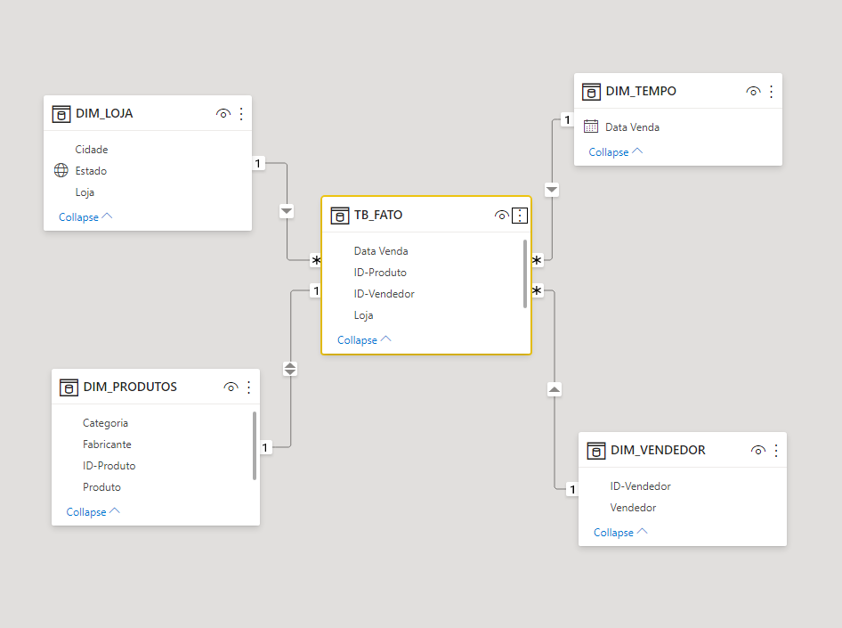

```{r setup, include=FALSE}
knitr::opts_chunk$set(echo = TRUE)
```

## Star Schema

O esquema em estrela é utilizado para normalizar o banco de dados, originalmente é utilizado em Data Lakes, porém pode ser feito no PowerBI, entretanto, de forma simplificada. 

O esquema visa separar em varias tabelas diferentes, dados relativos a mesma chave primaria, normalizando.


