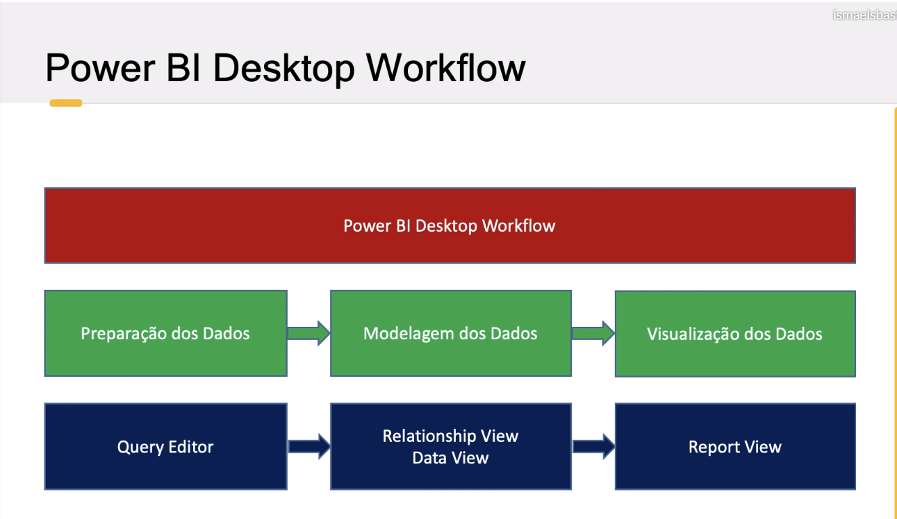

```{r setup, include=FALSE}
knitr::opts_chunk$set(echo = TRUE)
```

## Data Workflow

Data Workflow, assim como o nome sugere, está relacionado ao fluxo de realização de tarefas no PowerBI




## Cardinalidade

Forma pela qual são implementados os relacionamentos entre as tabelas;

Tipos de relação de cardinalidade


**Um para muitos (1:*) e Muitos para mim (*:1): ** Esse tipo de relação ocorre quando estamos indo de uma tabela contendo uma primary key, para outra em que a primary key é uma foreign key e não unica (1:*), e o contrário (*:1)

**Um para um (1:1): ** Nas duas tabelas a coluna não contem dados duplicados.

**Muitos para muitos: **  Periogoso, quando usada deve se ter atenção
Uma dica para realizar esse tipo de relação é criar uma tabela intermediária que contenha uma coluna como primary key. Essa tabela irá funcionar como um man in the middle. (*:1)> tabela do meio >(1:*)


## Power Query M e DAX

São linguagens de programação aplicadas ao PowerBI, pode ser usado para criação de novas colunas. Para usar o PowerQuery M basta adicionar uma coluna customizada na interface do PowerQuery Editor. Já para usar DAX,tem que adionar coluna em ferramentas de coluna. O Dax usa as mesmas funções do EXCEL, entretanto, não oferece todas as formulas.