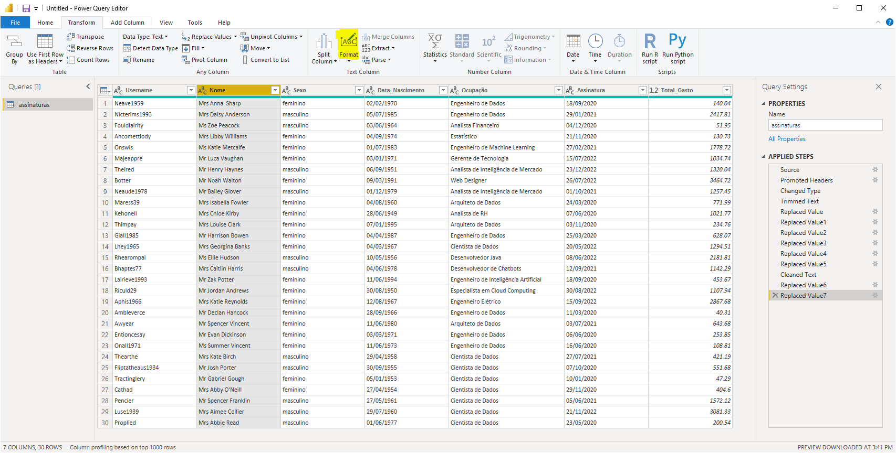

```{r setup, include=FALSE}
knitr::opts_chunk$set(echo = TRUE)
```

## Data Cleaning

Para remover espaços no final dos dados de uma coluna, basta selecionar a coluna e em seguida ir em format e selecionar trim, para remover espaços desncessários entre as palavras, basta usar a opção clean. Se ainda assim permanecerem espaços entre as palavras, basta clicar com o botao direito em cima da coluna e e replavc values

