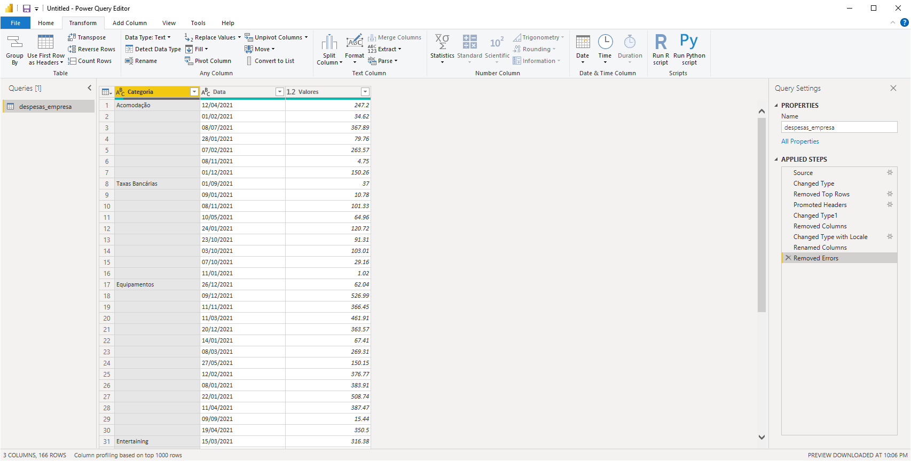

```{r setup, include=FALSE}
knitr::opts_chunk$set(echo = TRUE)
```

## Data Cleaning


### Remover espaços extras dos valores

Para remover espaços no final dos dados de uma coluna, basta selecionar a coluna e em seguida ir em format e selecionar trim, para remover espaços desncessários entre as palavras, basta usar a opção clean. Se ainda assim permanecerem espaços entre as palavras, basta clicar com o botao direito em cima da coluna e e replavc values

### Capitalizar palavras 

Para fazer com que todas as letras dos valores do tipo string comecem com letra maiúscula, basta ir na ferramenta format dentro do power query e  selecionar Capitalize Each Word

### Remover linhas em branco

Basta ir em Home > Remove Rows > Remove Blank Rows

### Dividir coluna

Pode acontecer da coluna ter mais de uma informação, para dividir essa coluna em outras colunas, basta clicar com botão direito na coluna e em split.

### Mudar tipo com virgula

Para mudar o tipo de dado para valores com vírgula, basta clicar com botão direito na coluna, selecionar change type e em seguida using locale.

### Preencher Linhas com valores faltantes



Se a linha estiver sema nada escrito, primeiramente deve-se usar a função replace para preencher com "null" e em seguida fill>down or up. Caso já tenha valores, basta usar fill>up or down

### Forecast

Podemos fazer previsão de séries temporais, basta utilizar gráfico de linhas e ir na lupinha (Analytics) e selecionar forecast. Vale ressaltar, que devemos ter um dado variando ao longo do tempo para realizar essa operação.