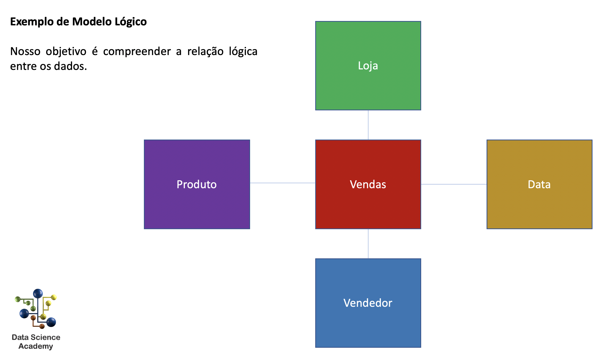
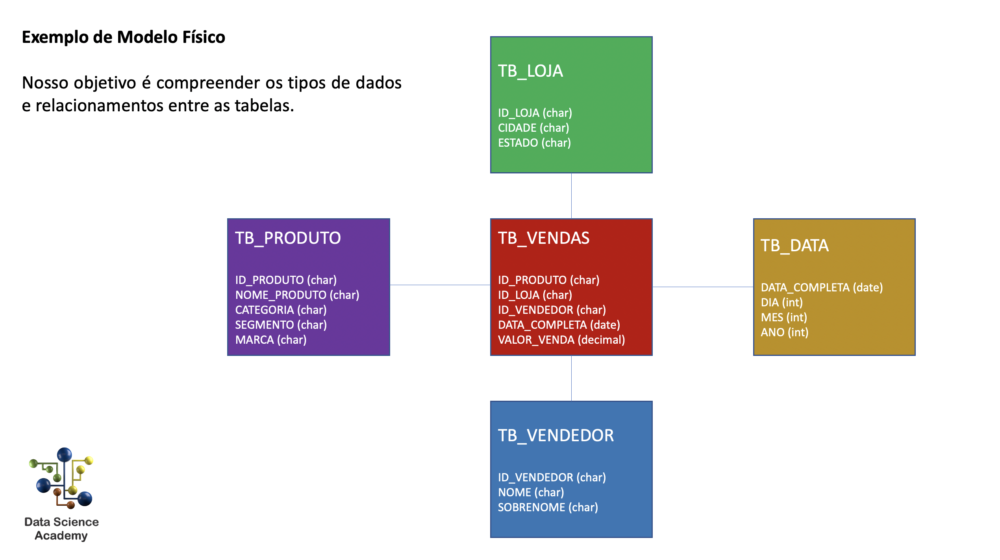
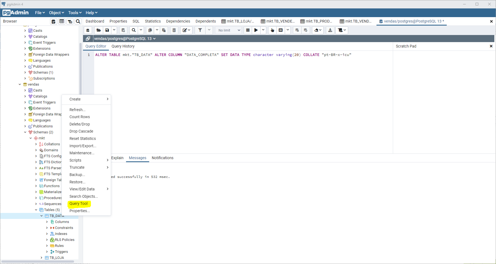

```{r setup, include=FALSE}
knitr::opts_chunk$set(echo = TRUE)
```

## Criando um Data Warehouse

Nesse capítulo é feita a criação de um data warehouse usando PostgreSQL, um data warehouse nada mais é que um banco de dados consolidado, que tem por objetivo armazenar apenas as informações relevantes e necessárias para analises posteriores.

### Modelo Lógico

O modelo lógico tem por objetivo apenas  evidenciar a relação entre as informações de uma empresa, é uma parte abstrata.



### Modelo Físico

O modelo físico tem por objetivo orientar a construção do banco de dados, oferecendo nomes de tabelas, assim como as colunas que serão usadas



## PostgreSQL

Criar um banco de dados e colunas no postgre é tarefa extremamente simples, basta usar o pgAdmin4 

### Problema com formato de data 

Pode ocorrer do formato de data fornecido nos dados estar no formato brasileiro, enquanto o banco de dados está configurado para estados unidos. Nesse caso, se faz necessário executar um comando no query editor.



```ALTER TABLE mkt."TB_DATA" ALTER COLUMN "DATA_COMPLETA" SET DATA TYPE character varying(20) COLLATE "pt-BR-x-icu" ```
